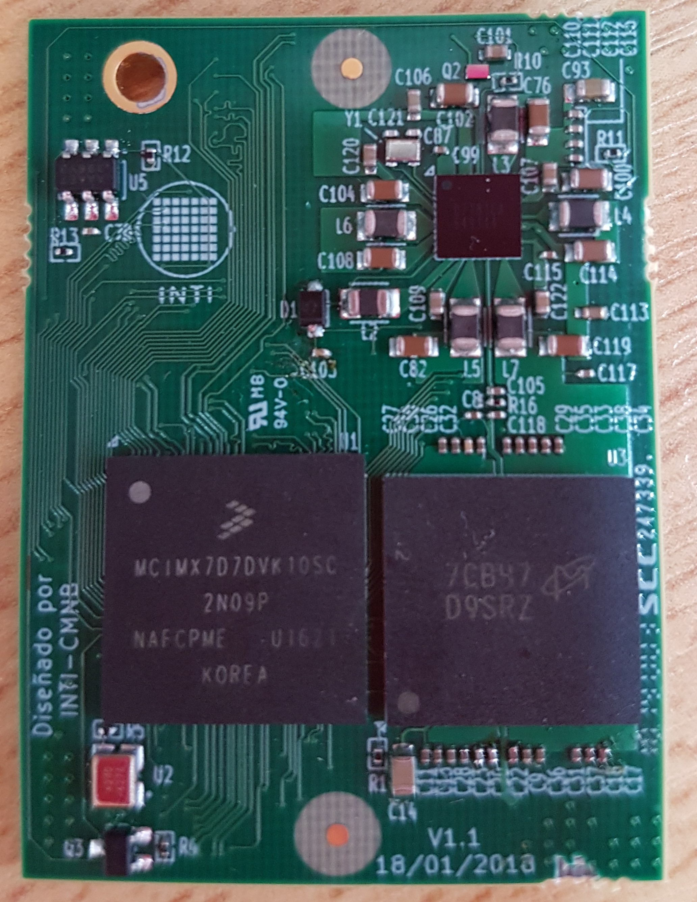

# IMX7 SOM

Here you will find KiCad design files, gerber files and some documentation for a System on Module board
developed by [INTI Argentina](http://www.inti.gob.ar/) with the collaboration of [Enye Technologies](https://enyetechnologies.com/) as part of the [Bombshell Project](https://bombshell.ink/).

 - Authors: [Authors](AUTHORS.md).
 - License: [IMX7 SOM license](LICENSE).

